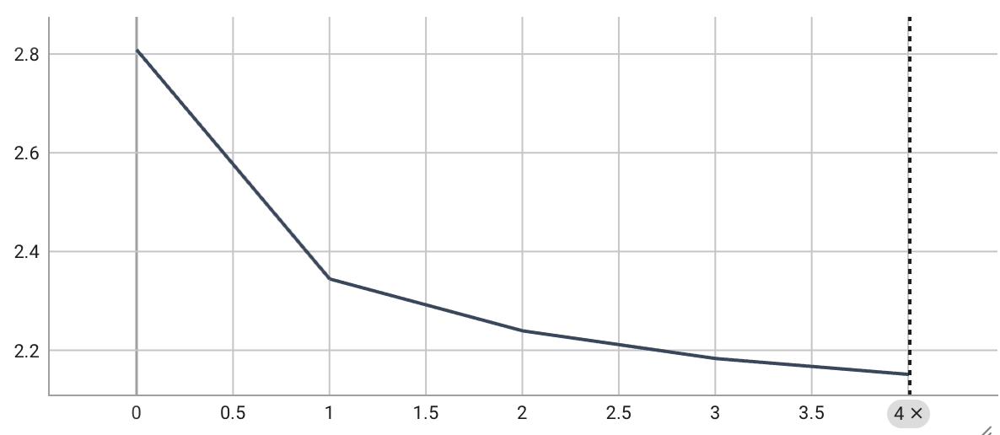
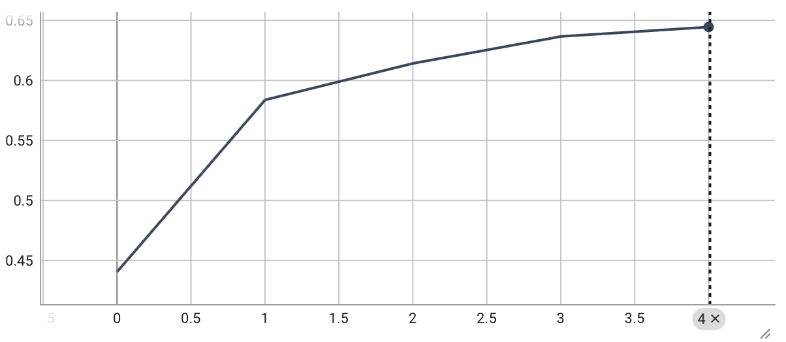

This repo contains training and evaluation code for a skip-gram word2vec model with negative sampling (SGNS word2vec). No machine learning packages are used in this project, just NumPy.

# How to Use
## 1. Set up Environment
The package management for this project is done with `conda`. To install the requisite packages, run:
```bash
conda env create -f environment.yml
```

And activate the environment with:
```bash
conda activate jetbrains-word2vec
```

Note that although PyTorch is a dependency, no actual machine learning features are used. It is only used for writing statistics to TensorBoard.


## 2. Download The text8 Dataset
Due to the large size of the text8 dataset (around 100MB), it is not included in the GitHub repository. Instead, you can run the following command to download it:
```bash
python scripts/download_text8.py
```


## 3. Preprocess The Dataset
Before being used for training, the dataset is preprocessed using:
```bash
python scripts/preprocess.py --corpus_size=0 --min_frequency=5 --subsample_threshold=1e-5
```

For more information about the arguments, run:
```bash
python scripts/preprocess.py -h
```


## 4. Train The Model
```bash
python scripts/train.py --preproc_dir_name=cs0-mf5-st1e-05 --epoch=5 --batch_size=32 --initial_lr=2 --final_lr=0.001 --num_neg_samples=5 --window_size=5 --embed_dim=100
```

For more information about the arguments, run:
```bash
python scripts/train.py -h
```

After or during training, you can monitor the progressing of training loss and Spearman's correlation coefficient (SCC, my evaluation metric of choice) with TensorBoard. To start the TensorBoard web app, run:
```bash
tensorboard --logdir=runs/
```

After that, go to `http://localhost:6006/` to access the web app.


## 5. Evaluate The Model
A script is provided for calculating SCC on a pre-trained model file. Run:
```bash
python scripts/evaluate.py --model_path=RELATIVE/PATH/TO/MODEL/FILE --word_map_path=RELATIVE/PATH/TO/WORD/MAP/FILE
```

A demo is available with:
```bash
python scripts/evaluate.py --model_path=models/good/model.npz --word_map_path=models/good/word_id_map.pkl
```


# Project Structure
For clarity and ease of understanding, this project adopts a PyTorch-like file structure, in which the model, dataloader and optimizer are separate classes.

```
word2vec/
├── .gitattributes
├── .gitignore
├── README.md
├── environment.yml
├── data/						# Datasets and preprocessing results
│   ├── text8.txt					# Training set: text8
│   ├── ws-353.csv					# Evaluation set: WordSimilarity-353
│   └── cs0-mf5-st1e-05/			# Demo preprocessing results
│       ├── word_id_array.npy
│       └── word_id_map.pkl
├── models/						# Pre-trained model checkpoints
│   └── demo/						# Demo
│       ├── model.npz					
│       └── word_id_map.pkl
├── runs/						# TensorBoard metric logs
│   └── demo/						# Demo
│       └── events.out.tfevents
├── scripts/					# Scripts for a certain action
│   ├── download_text8.py			# Downloads the text8 dataset
│   ├── evaluate.py					# Evaluates a pre-trained model file
│   ├── preprocess.py				# Preprocesses the text8 dataset
│   └── train.py					# Trains the word2vec model
└── src/						# Provides classes to support scripts
    ├── __init__.py
    ├── dataloader.py				# Dataloader, generates batched word ID pairs
    ├── evaluator.py				# Evaluator
    ├── model.py					# Model structure, forward and backward behavior
    └── optimizer.py				# Optimizer, used to update model weights
```


# Method
## SGNS Word2Vec: An Overview
The goal of any word2vec model is to map words to vectors that capture their semantic meaning. An SGNS (Skip-Gram with Negative Sampling) word2vec model achieves this through the following process:

1. **Generating word pairs.** For each word in the corpus (the center word), collect positive context words — those within a fixed-size window around the center word — and negative context words — those randomly sampled from a noise distribution over the entire vocabulary.
2. **Looking up embeddings.** Map the center word to its embedding using the center matrix, and map each context word to its embedding using the context matrix.
3. **Optimizing distances.** Minimize the distance between the center word and its positive context words, and maximize the distance between the center word and its negative context words.

This process clusters words that frequently co-occur in the corpus, while pushing apart words that do not.


## Dataset and Metric Selection
### text8
The training set used for this project is text8, a partial text dump of Wikipedia containing approximately 17 million words. The text is cleaned to lowercase and delimited by whitespace.

text8 is chosen for two reasons: its size strikes a good balance between semantic richness and training time, and its format requires no additional cleaning or preprocessing.

The dataset file is downloaded from http://mattmahoney.net/dc/text8.zip on 15/03/2026 at 10:58 PM. As text8 is no longer a work in progress, the file should remain unchanged for the foreseeable future.


### WordSimilarity-353
Because the skip-gram word2vec model does not have an intrinsic evaluation metric, a downstream task — consisting of an evaluation set and a metric — is needed to assess model performance.

I use the WordSimilarity-353 test collection as the evaluation set. It consists of 353 word pairs, each annotated with a human-judged similarity score ranging from 0 to 10. This dataset is a natural fit because it directly measures the kind of semantic relatedness that word2vec is designed to capture. The file is downloaded from https://gabrilovich.com/resources/data/wordsim353/wordsim353.zip on 19/03/2026 at 9:05 PM. As this dataset is also no longer a work in progress, the file should remain unchanged.

The evaluation metric is Spearman's rank correlation coefficient (SRCC) between predicted similarity scores and human scores. Predicted similarity is computed as the cosine similarity between two words' embedding vectors: because cosine similarity measures angular proximity, it reflects how semantically close the model judges two words to be. SRCC is appropriate here because the predicted scores and human scores occupy different numerical ranges, and SRCC is scale-invariant — it compares only the relative ordering of values, not their magnitudes. Concretely, SRCC independently ranks the values within each list and then measures how well the two rankings agree, making it a robust measure of monotonic association. SRCC falls in a range of [-1, 1], where -1 denotes complete negative correlation, 0 denotes no correlation, and 1 denotes complete positive correlation.


## Dataset Preprocessing
The text8 dataset undergoes two preprocessing steps before training: building a dictionary that maps each word to an integer ID, and converting the corpus into an array of these integer IDs.

Two additional mechanisms are applied during preprocessing to help the model learn more meaningful semantic information.

1. **Low-frequency cutoff.** Words whose occurrence counts fall below a threshold are excluded from both the vocabulary and the corpus array. This removes extremely rare words (e.g., "anarchiste") for which the model cannot learn meaningful embeddings, eliminating wasted computation. With a threshold of 5, 28.08% of the vocabulary and 98.32% of all word tokens are retained — demonstrating that only a small fraction of vocabulary entries accounts for the vast majority of the corpus.

2. **Frequency-based subsampling.** Extremely frequent words (e.g., "a", "the") co-occur with nearly every other word, so training on them contributes little semantic information. Frequency-based subsampling retains each word in the corpus array with probability:
$$\min\!\left(\sqrt{\frac{t}{f}} + \frac{t}{f},\; 1\right)$$
where $f$ is the word's corpus frequency and $t$ is the subsampling threshold [1]. With $t = 10^{-5}$ (applied after low-frequency cutoff), only 34.59% of words are retained. Although this may seem aggressive, most of the discarding targets high-frequency words: for example, "the" (frequency ≈ 0.07) is kept only 12.10% of the time, while a word with frequency 0.000025 is never discarded. Frequency-based subsampling thus preserves most of the corpus's semantic content while reducing training compute to roughly one-third.


## Dataloader
At each iteration, the dataloader produces a batch of training pairs: (center word, positive context word) and (center word, negative context word). These are represented by three arrays: center word IDs, positive context word IDs, and negative context word IDs.

The dataloader iterates over each center word in the corpus and, for each center word, iterates over the words within its context window. Each (center word, context word) pair is recorded by appending the respective IDs to the center and positive arrays.

For each center word, a fixed number of negative context words are randomly drawn from a unigram distribution raised to the 3/4 power [1]. This exponent boosts the sampling probability of rare words and reduces that of frequent words, which improves semantic learning — similar in spirit to frequency-based subsampling during preprocessing.

There are a number of features worth discussing:

1. **Batching.** Training examples are grouped into batches with the goals of reducing training time and improving gradient stability. In practice, I found that per-epoch training time remained nearly constant across a wide range of batch sizes, likely because the CPU cannot fully exploit parallelism even with a highly vectorized library like NumPy.

2. **Dynamic context window.** Following [2], the context window size for each center word is uniformly chosen from [1, max context window radius] at random. This helps to give more weight to closer co-occurring word pairs, and also reduces the size of training data eventually fed into the model by roughly 30%.

3. **Shuffling.** For each epoch, the order of center words are shuffled. The added randomness helps with convergence, while keeping the center-positive and center-negative relations intact.

The max context window radius and the number of negative samples per center word are both tunable hyperparameters. Following [2], both are set to 5.


## Model Architecture
Following [2], the model consists of two weight matrices: a center matrix and a context matrix. Both have shape (vocabulary size × embedding dimension), where each row stores the embedding vector for a single word.


## Forward Pass and Loss Function
A forward pass consists of two steps:

1. **Embedding lookup.** For each center word ID, extract the corresponding center embedding $u$ from the center matrix. Similarly, extract the positive context embedding $v^+$ and $k$ negative context embeddings $v_1^-,\dots,v_k^-$ from the context matrix.
2. **Loss computation.** Compute the negative log-likelihood loss:

$$\mathcal{L} = -\log\sigma(v^+ \cdot u) - \sum_{i=1}^{k}\log\sigma(-v_i^-\cdot u)$$

This loss encourages positive pairs to have similar embeddings (high dot product) and negative pairs to have dissimilar embeddings (low dot product). In a batched setting, the loss is the mean over all data points in the batch.

## Backward Pass
The partial derivatives of $\mathcal{L}$ with respect to each parameter are:

$$\begin{align}
\frac{\partial\mathcal{L}}{\partial u} &= \bigl(\sigma(v^+\cdot u) - 1\bigr)\,v^+ + \sum_{i=1}^{k}\bigl(1 - \sigma(-v_i^-\cdot u)\bigr)\,v_i^- \\
\frac{\partial\mathcal{L}}{\partial v^+} &= \bigl(\sigma(v^+\cdot u) - 1\bigr)\,u \\
\frac{\partial\mathcal{L}}{\partial v_i^-} &= \bigl(1 - \sigma(-v_i^-\cdot u)\bigr)\,u
\end{align}$$

Several terms in these expressions are already computed during the forward pass. To avoid redundant work, the following intermediate values are cached during the forward pass for reuse in the backward pass:

1. The word IDs (used to scatter weight updates to the correct matrix rows)
2. $u$, $v^+$, and $v_i^-$
3. $\sigma(v^+\!\cdot u)$ and $\sigma(-v_i^-\!\cdot u)$

The gradients are also scaled down by the of the actual batch size (the number of center–positive pairs) to match the batch-averaged loss.


## Parameter Updates
Parameters are updated using stochastic gradient descent with global linear learning rate decay, as in [2].

At each optimizer step, the stored gradients, scaled by the current learning rate, are subtracted from the corresponding rows of the weight matrices. The cached word IDs serve as row indices, enabling sparse weight updates: because each matrix row is independent and only a subset of rows is active per batch, this avoids unnecessary computation and reduces memory usage.

A global batch counter, maintained across epochs, controls the linear decay of the learning rate over the full course of training. My experiments show that without learning rate decay, training loss and SRCC can plateau or deteriorate in later epochs, consistent with the observation in [2] that decay helps prevent overfitting.

Batch size is also a tunable hyperparameter, and is set to 5. This is motivated by theoretical observations that a high epoch count can lead to overfitting [2], as well as the flattening of loss and SRCC curves during my experiments.


## Evaluation
As described above, evaluation uses the WordSimilarity-353 dataset and SRCC metric. When loading the evaluation set, any row containing a word absent from the model's vocabulary is discarded. A coverage rate is reported afterward. This approach is straightforward and ensures the evaluation reflects only what the model has actually learned, rather than guesswork.


# Results
Using the aforementioned hyperparameter values, I successfully trained a word2vec model. The loss and SRCC curve during training are as follows:





During the course of training, the loss decreases and SRCC increases, both quickly at first but gradually slowing down, confirming that global learning rate decay is behaving as expected and preventing overfitting. The SRCC eventually reaches a value of 0.645, indicating strong positive correlation between the human similarity scores and the predicted scores.


# References
[1] Mikolov, Tomas et al. "Distributed representations of words and phrases and their compositionality." International Conference on Neural Information Processing Systems (2013).

[2] Mikolov, Tomas et al. “Efficient Estimation of Word Representations in Vector Space.” International Conference on Learning Representations (2013).